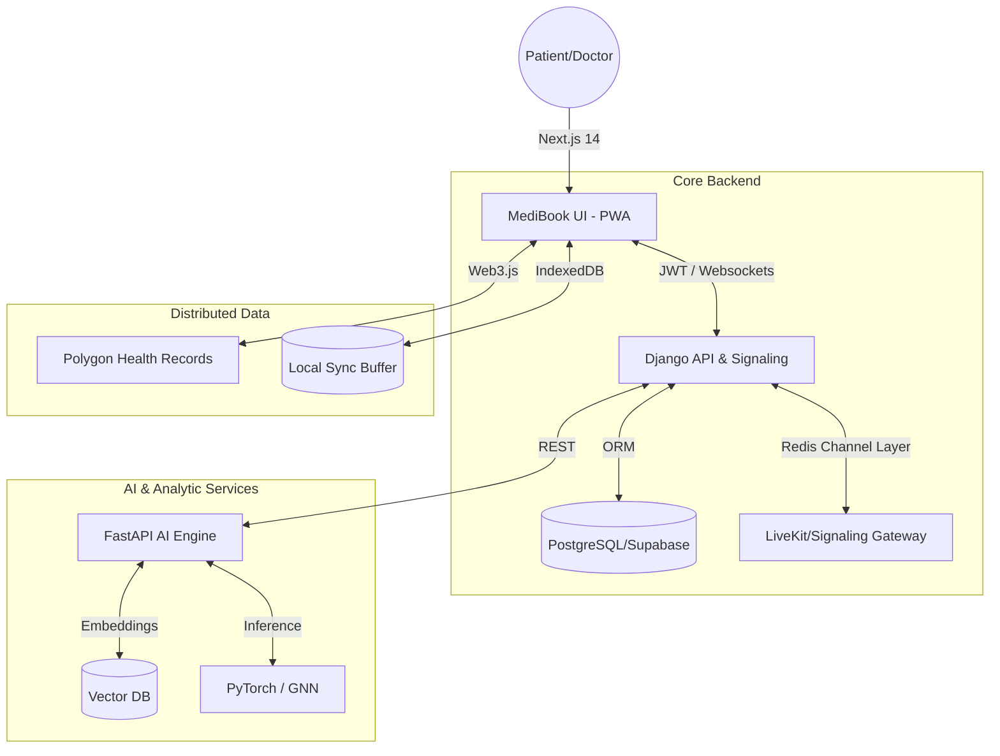

# 🧬 MedGenie: Next-Gen Digital Twin Healthcare System

[](https://github.com/martian3062/Digital_Twin-Evolet)
[](https://github.com/martian3062/Digital_Twin-Evolet)
[](LICENSE)

> A state-of-the-art, privacy-centric healthcare platform that utilizes **AI Digital Twins**, **WebRTC Signaling**, and **Blockchain Verification** to provide secure, real-time medical consultation and predictive health modeling.

---

## 🌟 Core Features

### 🧠 AI Digital Twin Engine
*   **Predictive Modeling**: Temporal Transformers and GNNs analyze your vital history to simulate future health states.
*   **Anomaly Detection**: Real-time monitoring of biometrics with smart alerts for heart rate, SpO2, and sleep patterns.
*   **AI Scribe**: Automatic voice-to-text medical transcription during consultations using Whisper AI.

### 🎥 Secure P2P Consultations
*   **Stateless JWT Audio/Video**: Hardened WebRTC signaling gateway with identity-locked room access.
*   **Consultation Authorization**: Strict backend verification ensuring only the assigned Doctor and Patient can join a session.
*   **Encrypted Data Stream**: Peer-to-peer communication reducing server overhead and maximizing privacy.

### 🔐 Decentralized Security (Phase 3 Ready)
*   **MedGenie Vault**: Blockchain-backed medical record access control on Polygon/Ceramic.
*   **DID Identity**: Decentralized Identifiers (DIDs) for patient-owned health data.
*   **Offline-First Resilience**: Full PWA support with IndexedDB background sync for low-connectivity environments.

---

## 🏗️ System Architecture



---

## 🚀 Getting Started

### 📋 Prerequisites
- **Python 3.10+** (for Backend & AI)
- **Node.js 18+** (for Frontend)
- **Redis** (for Channels/WebSockets)
- **Git**

### 1. Backend API (Django)
```bash
cd backend
python -m venv venv && source venv/bin/activate
pip install -r requirements.txt
python manage.py migrate
python manage.py runserver  # Runs on Port 8000
```

### 2. AI Engine (FastAPI)
```bash
cd ai_engine
pip install -r requirements.txt
python server.py  # Runs on Port 8100
```

### 3. Frontend (Next.js)
```bash
cd frontend
npm install
npm run dev  # Runs on Port 3000
```

---

## 🛡️ Security Hardening

MedGenie utilizes a multi-layer security approach:
- **JWT-over-WS**: WebSocket connections are authenticated via stateless JWT tokens passed in query strings.
- **Consultation Locking**: Room IDs are tied to database-backed Consultation objects. Unassigned users are automatically disconnected with a `4003 Unauthorized` close code.
- **Environment Isolation**: Sensitive keys for Google Fit, Twilio, and Polygon are strictly isolated in `.env`.

> [!IMPORTANT]
> To verify signaling security, you can run the internal test suite:
> `python scripts/verify_signaling.py`

---

## 📄 License
Distributed under the MIT License. Built for the **AMTZ Digital Twin Initiative**.
